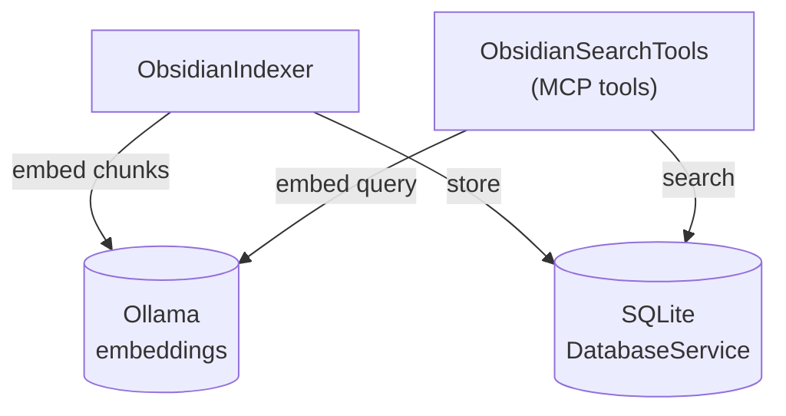
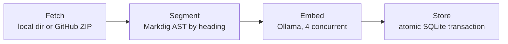
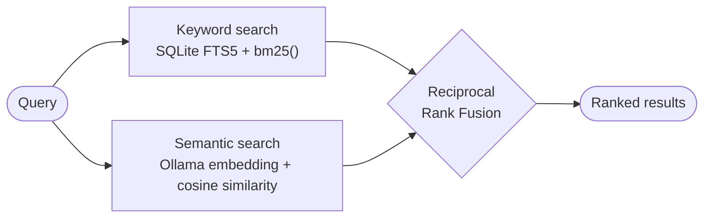

# Architecture
{: .no_toc }

1. TOC
{:toc}

## Overview

The server is a .NET 10 [Generic Host](https://learn.microsoft.com/dotnet/core/extensions/generic-host) application that speaks MCP over stdio (via the official [ModelContextProtocol C# SDK](https://modelcontextprotocol.github.io/csharp-sdk)). All logging goes to stderr, since stdout is reserved for the JSON-RPC protocol stream.

There are four moving pieces:



## Indexing pipeline (`ObsidianIndexer`)



1. **Fetch**: for each documentation source (Developer Docs, User Help), the indexer first checks for a local directory override (`Docs:DeveloperDocsPath` / `Docs:UserHelpPath` in config). If not present, it downloads the corresponding GitHub repository as a ZIP archive directly into memory (`HttpClient` + `System.IO.Compression.ZipArchive`) — no disk clone required. Downloads are capped at 200MB total and 5MB per file to guard against a misconfigured URL or a decompression bomb, and the whole download (headers + body) is bounded by a 5-minute cancellation token so a stalled/throttled connection fails loudly instead of hanging indefinitely. Each source can also be restricted to specific top-level folders (`Docs:DeveloperDocsIncludeFolders` / `Docs:UserHelpIncludeFolders`, or the per-call `userHelpFolders`/`developerDocsFolders` parameters) — e.g. limiting `obsidian-help`'s 32 language folders down to just `en,es,Sandbox` — filtered out before the entry is even read, so excluded files never reach segmentation or embedding.
2. **Segment**: each Markdown file is parsed with [Markdig](https://github.com/xoofx/markdig) and split into logical chunks along heading boundaries (levels 1-4, both ATX `#`-style and setext `===`/`---`-style), with a safety split at ~2000 characters if a section runs long. Parsing the real AST (rather than a line-by-line scan) means headings inside fenced code blocks are correctly ignored. Each chunk gets a deterministic SHA-256 ID derived from its file path, index, and heading.
3. **Embed**: each chunk is sent to Ollama's `/api/embeddings` endpoint (model `nomic-embed-text`) with a prompt combining title, heading, and content, with up to 4 requests in flight concurrently. Embedding failures for individual chunks are tolerated — that chunk simply falls back to keyword-only search.
4. **Store**: the whole corpus is replaced atomically — clearing the old rows and inserting the new ones happens inside a single SQLite transaction, so a search running concurrently either sees the complete previous index or the complete new one, never a partial/empty state, and a failed reindex leaves the previous index intact. Chunks are stored one row per chunk in a `Chunks` table (with the embedding as a `BLOB`), plus a mirrored row in an FTS5 virtual table (`ChunksFTS`, `porter unicode61` tokenizer) for keyword search. The database runs in WAL journal mode so readers are never blocked by a concurrent writer.

Only one reindex can run at a time — a `ReindexDocumentation` call while another reindex is already in progress is rejected immediately instead of racing the running one.

### First-run bootstrap

On startup, if the local index is empty, the server tries `ObsidianIndexer.TryDownloadPrebuiltIndexAsync()` before falling back to the live pipeline above: it downloads a periodically-regenerated SQLite database (with embeddings already computed) from a fixed GitHub Release asset (tag `docs-index`, kept separate from this project's own versioned software releases), and only runs a live reindex if that download is disabled (`Docs:UsePrebuiltIndex: false`) or fails for any reason.

## Hybrid search (`ObsidianSearchTools.SearchDocumentation`)

A single search call runs two independent retrieval strategies in parallel:



- **Keyword search**: SQLite FTS5 `MATCH` query, ranked by the native `bm25()` function, converted to a 0–1 score via a sigmoid transform.
- **Semantic search**: the query text is embedded via Ollama, then compared against every stored chunk embedding using cosine similarity. Scores are streamed into a bounded top-K min-heap sized to the requested `limit` as rows come off the database reader, rather than loading the full corpus into memory and sorting it — still a brute-force scan (no ANN index), but without the extra full-materialization and full-sort cost.

### Reciprocal Rank Fusion (RRF)

The two ranked result lists are merged using RRF:

```
score(chunk) = Σ 1 / (k + rank_in_listᵢ)   for each list i where chunk appears
```

with `k = 60` (a standard smoothing constant). This means a chunk that ranks well in *either* list contributes meaningfully to the final score, and a chunk that ranks well in *both* lists is boosted further — without needing to tune relative weights between the two engines. Results are deduplicated by `(FilePath, Header)` before fusion.

RRF only decides the merged *order* — its magnitude (~1/k) isn't a meaningful relevance measure on its own, so it's never returned to callers. The `MatchPercent` field in the response is instead the best of the underlying cosine-similarity/BM25-derived percentages for that chunk, giving an interpretable 0-100 match quality regardless of which method(s) found it.

## Other MCP tools

- **`ReindexDocumentation`**: fires the full indexing pipeline above as a background `Task.Run`, returning immediately so it doesn't block the MCP stdio transport during a multi-minute reindex.
- **`IndexStatus`**: returns the current row count in the `Chunks` table, whether a reindex is in progress, and the last reindex error if one occurred — a quick way for an agent (or you) to check whether the index has been built and healthy.

## CLI mode

Besides running as an MCP stdio server, the same binary supports direct CLI subcommands for convenience:

```bash
obsidian-docs-mcp index                    # run the indexing pipeline once and exit
obsidian-docs-mcp index en,es,Sandbox      # same, restricted to these top-level folders
obsidian-docs-mcp index-status             # print chunk count / reindex progress / last error
obsidian-docs-mcp search "query"            # run a hybrid search from the terminal
obsidian-docs-mcp setup                    # auto-write the Claude Desktop config entry
```
